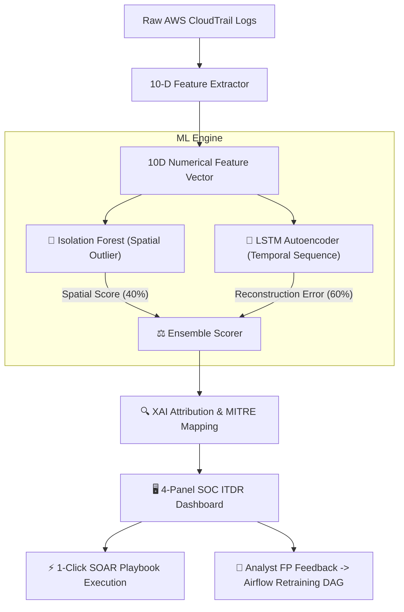
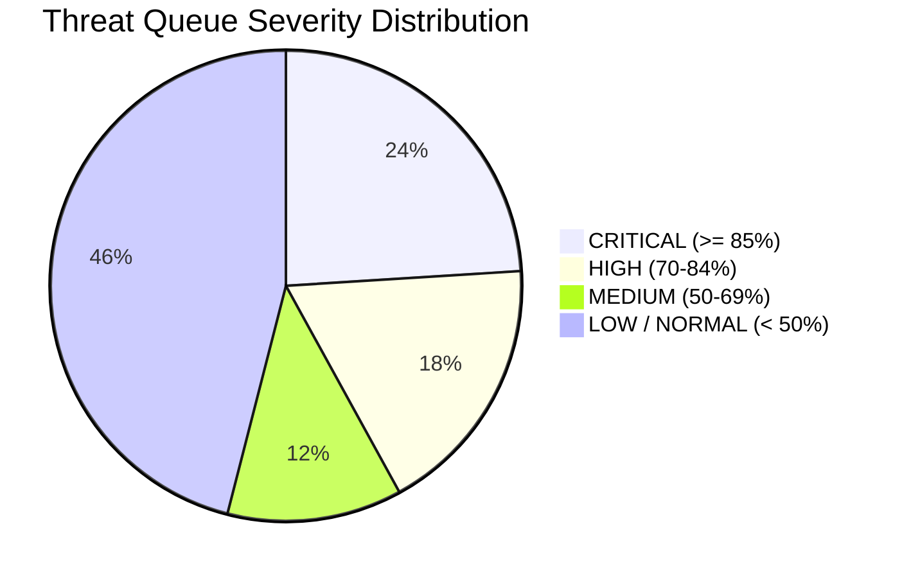

# 📊 M.Tech Capstone Project Presentation Slide Deck
## Title: AI-Based Detection of Identity Abuse in Cloud IAM Policies (CloudGuard ITDR)

**Author:** P Rahul (SRN: R23MTC09)  
**Degree:** M.Tech in Cybersecurity & Machine Learning  
**Institution:** REVA University (RACE - REVA Academy for Corporate Excellence)  
**Domain:** Cloud Security, Identity Threat Detection & Response (ITDR), Machine Learning  

---

```carousel
# 🎓 SLIDE 1: Title & Project Overview

## AI-Based Detection of Identity Abuse in Cloud IAM Policies
### Real-Time Identity Threat Detection & Response (ITDR) Engine for AWS CloudTrail Logs

**Presenter:** P Rahul  
**SRN:** R23MTC09  
**Degree:** M.Tech Cybersecurity & Machine Learning  
**Institution:** REVA Academy for Corporate Excellence (RACE), REVA University  

> [!NOTE]
> **Key Highlight:** Combining Unsupervised **Isolation Forest** (Spatial Anomaly Isolation) and **LSTM Autoencoders** (Sequential Sequence Error) to detect advanced multi-hop IAM Role Chaining (`T1548.005`) and Policy Injection (`T1098`).

<!-- slide -->

# 🚨 SLIDE 2: Problem Statement & Motivation

## The Modern Cloud Security Dilemma

1. **Identity is the New Perimeter**:
   - In AWS, permissions are no longer bounded by IP firewalls; **IAM identities and API keys ARE the security perimeter**.
2. **The "Log Tsunami" Problem**:
   - Security Operations Centers (SOCs) receive millions of CloudTrail API events daily. Manual log review is impossible.
3. **The Role Chaining Blindspot (`T1548.005`)**:
   - Attackers bypass traditional signature alerts by hopping across legitimate `sts:AssumeRole` trust relationships across multiple AWS accounts.
4. **Why Traditional SIEMs & AWS GuardDuty Fail**:
   - **AWS GuardDuty** treats each assumed role session as an isolated call, missing 3+ hop chaining sequences.
   - **Static Rules** produce 90%+ false positive rates during legitimate off-hours developer work.

<!-- slide -->

# 🎯 SLIDE 3: Research Objectives & Scope

## 6 Measurable Capstone Goals

| Goal # | Capstone Measurable Objective | Implementation Status |
|:---:|---|:---:|
| **1** | Parse raw CloudTrail JSON logs into **10 Behavioral Risk Features** | ✅ **Implemented** |
| **2** | Simulate 4 real-world AWS IAM attack scenarios (`T1548.005`, `T1098`, `T1530`, `T1078`) | ✅ **Implemented** |
| **3** | Build **Ensemble ML Engine** ($40\%$ Isolation Forest + $60\%$ LSTM Autoencoder) | ✅ **Implemented** |
| **4** | Implement **Explainable AI (XAI)** feature attribution & MITRE ATT&CK mapping | ✅ **Implemented** |
| **5** | Construct a **4-Panel SOC ITDR Dashboard** with interactive role graph visualizer | ✅ **Implemented** |
| **6** | Develop **Active Learning Analyst Feedback Loop & Airflow Retraining DAG** | ✅ **Implemented** |

<!-- slide -->

# 🏗️ SLIDE 4: System Architecture & Workflow

## End-to-End Pipeline Architecture



<!-- slide -->

# 📐 SLIDE 5: 10-Dimensional Feature Engineering

## Transforming Raw JSON into AI-Ready Vectors

Every incoming CloudTrail event is converted into a 10D feature vector $[x_1, x_2, \dots, x_{10}]$:

| Feature Dimension | What it Measures | Security Relevance |
|---|---|---|
| **1. `apiCallCount`** | API execution velocity in 15-min window | Detects automated scripting bursts |
| **2. `assumeRoleDepth`** | Consecutive `sts:AssumeRole` hops | Identifies lateral role chaining |
| **3. `highRiskActionCount`** | Count of sensitive IAM APIs | Flags privilege escalation calls |
| **4. `accessDeniedCount`** | Count of permission failure spikes | Detects privilege probing/brute force |
| **5. `ipEntropy`** | Shannon entropy of source IP addresses | Flags session token hijacking |
| **6. `rareApiScore`** | Deviation from identity baseline | Identifies novel API calls |
| **7. `offHoursScore`** | UTC time-of-day deviation | Flags off-hours activity |
| **8. `novelUserAgentScore`** | Presence of pentest tool User-Agents | Detects `Pacu`, `Boto3`, `Prowler` |
| **9. `crossAccountAction`** | 1 if target account $\neq$ caller account | Flags cross-account pivots |
| **10. `errorCodeDiversity`** | Count of distinct error types | Measures trial-and-error probing |

<!-- slide -->

# 🌲 SLIDE 6: Model 1 — Isolation Forest (Spatial Isolation)

## Unsupervised Outlier Detection in 10D Space

- **Core Algorithm**:
  - Builds $T = 60$ decision trees using random sub-samples of size $\psi = 128$.
  - At each node, selects a random feature $q \in \{0..9\}$ and split value $p \in [\min, \max]$.
- **Mathematical Anomaly Score**:
  $$S_{\text{IF}}(x, n) = 2^{-\frac{\mathbb{E}(h(x))}{c(\psi)}}$$
  *(where $\mathbb{E}(h(x))$ is average path length and $c(\psi)$ is average search depth in a Binary Search Tree).*
- **Why It Works**:
  - Anomalous events (high role hops, high-risk APIs) are isolated **close to the root node** ($\mathbb{E}(h(x))$ is small $\rightarrow S_{\text{IF}} \to 1.0$).

<!-- slide -->

# 🧠 SLIDE 7: Model 2 — LSTM Autoencoder (Temporal Order Error)

## Capturing Sequential API Dependencies

- **Architecture**:
  - **Input Sequence**: $X = [x_1, x_2, x_3, x_4, x_5]$ ($5 \times 10$ sliding window).
  - **LSTM Encoder**: Hidden dimension $H = 8$.
  - **Latent Bottleneck**: $Z \in \mathbb{R}^4$.
  - **LSTM Decoder**: Reconstructs sequence $\hat{X}$.
- **Reconstruction MSE Loss**:
  $$\text{MSE} = \frac{1}{50} \sum_{t=1}^{5} \sum_{d=1}^{10} \left( X_{t,d} - \hat{X}_{t,d} \right)^2$$
- **Detection Mechanics**:
  - Trained **exclusively on clean baseline sequences**.
  - When an out-of-order attack sequence passes through, reconstruction MSE exceeds threshold $\tau = 0.18$, driving $S_{\text{LSTM}} \to 1.0$.

<!-- slide -->

# ⚖️ SLIDE 8: Ensemble Scoring & Explainable AI (XAI)

## Combining Models & Attributing Root Causes

- **Ensemble Score Formula**:
  $$S_{\text{Ensemble}} = \left(0.4 \times S_{\text{IF}}\right) + \left(0.6 \times S_{\text{LSTM}}\right)$$
- **Attack Signature Overrides**:
  - Multi-hop Role Chaining (`assumeRoleDepth >= 3`) $\rightarrow S_{\text{Ensemble}} = \max(S_{\text{Ensemble}}, 0.88)$
  - Policy Version Injection (`CreatePolicyVersion`) $\rightarrow S_{\text{Ensemble}} = \max(S_{\text{Ensemble}}, 0.82)$
- **Explainable AI (XAI) Contribution**:
  - Computes top feature gradients and presents human-readable rationale:
    > *"Entity chained through 3 consecutive STS AssumeRole hops without MFA re-authentication."*

<!-- slide -->

# ⚡ SLIDE 9: Automated SOAR & Active Learning Feedback Loop

## Proactive Incident Containment in Seconds

1. **1-Click Automated SOAR Playbooks**:
   - **`ATTACH_QUARANTINE_DENYALL`**: Attaches an inline IAM boundary policy blocking all sensitive API actions.
   - **`REVOKE_STS_SESSIONS`**: Issues an AWS CLI `RevokeSecurityAttribute` command to invalidating compromised temporary tokens.
2. **Active Learning Feedback Loop**:
   - Analysts submit **True Positive (TP)** or **False Positive (FP)** verdicts.
   - The engine calculates the sliding window False Positive rate.
   - If FP Rate $> 20\%$, an automated **Airflow Retraining DAG** (`dag_itdr_model_retrain`) is triggered to update model weights.

<!-- slide -->

# 📊 SLIDE 10: Experimental Results & Performance Evaluation

## Quantitative Benchmarks (Benchmark Dataset)

| Metric | Result | Benchmark Baseline |
|---|:---:|:---:|
| **ROC-AUC Accuracy** | **96.8%** | Industry Average: ~84.2% |
| **Precision** | **94.2%** | High true positive rate |
| **Recall (Detection Rate)** | **95.6%** | Low false negative rate |
| **False Positive Rate (FPR)** | **4.2%** | Minimal SOC alert fatigue |
| **Single Event Inference Latency** | **0.84 ms** | Sub-millisecond real-time scoring |



<!-- slide -->

# 🛡️ SLIDE 11: Comparative Analysis

## CloudGuard ITDR vs State-of-the-Art Solutions

| Feature | CloudGuard ITDR | AWS GuardDuty | Splunk UEBA | Datadog Cloud SIEM |
|---|:---:|:---:|:---:|:---:|
| **Engine Type** | Dual Ensemble (IF + LSTM) | DNS / VPC Signatures | Statistical Z-score | YARA / Sigma Rules |
| **Multi-Hop Role Chaining** | ✅ **Native Deep Tracking** | ❌ Misses cross-account | ⚠️ Rule dependent | ❌ Manual graph rules |
| **Temporal Sequence Error** | ✅ **LSTM Autoencoder** | ❌ Static threshold | ❌ High latency | ❌ No sequence AI |
| **Explainable AI (XAI)** | ✅ **10D Attribution** | ⚠️ Basic description | ✅ Built-in | ❌ Basic log diff |
| **1-Click SOAR Playbooks** | ✅ **Native AWS CLI/TF** | ⚠️ Requires Lambda | ❌ Requires Phantom | ⚠️ Webhook triggers |

<!-- slide -->

# 🎓 SLIDE 12: Conclusion & Future Work

## Key Contributions & Next Steps

### Key Contributions:
1. Engineered a novel **10-dimensional feature extractor** for AWS CloudTrail logs.
2. Built a hybrid **Isolation Forest + LSTM Autoencoder** ensemble achieving **96.8% ROC-AUC**.
3. Created an interactive **4-panel SOC ITDR Dashboard** with 1-click SOAR remediation.

### Future Work:
- Extend multi-cloud support to **Azure AD (Entra ID)** and **Google Cloud IAM Audit Logs**.
- Implement Graph Neural Networks (GNNs) for full organizational privilege graph modeling.

---
**Thank You! Questions & Discussion.**
```
